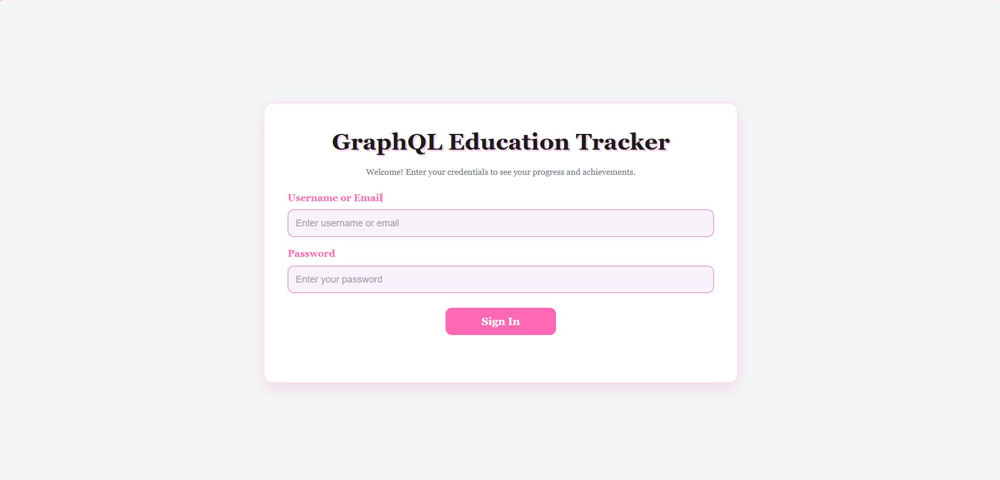
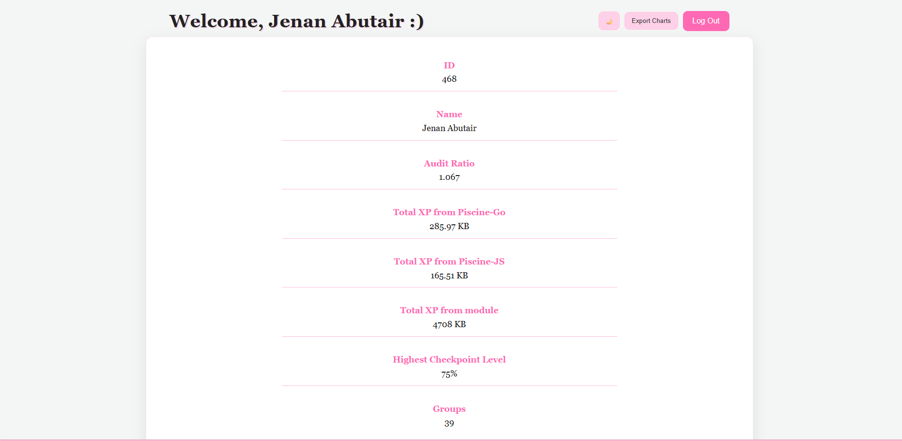
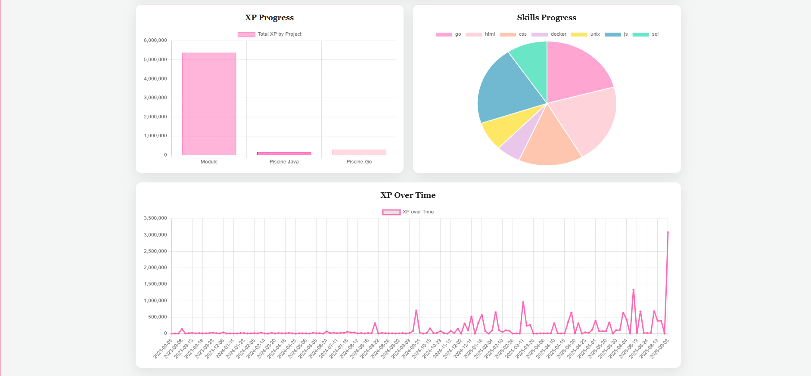

# GraphQL Education Tracker ✨

A front-end app that displays student data (XP, Skills, Progress) from the university GraphQL API.  
Includes **JWT login**, **dark/light theme**, and **chart export**.

---

## Table of Contents
- [Screenshots](#screenshots)
- [Features](#features)
- [Architecture](#architecture)
- [Getting Started](#getting-started)
  
---

## 📸 Screenshots

| Login | Dashboard (Info) |
|---|---|
|  |  |

| Charts |
|---|
|  |


---

## ✨ Features
- 🔐 **JWT login** (Basic → Bearer)
- 🧾 **Profile info**: ID, Name, Audit Ratio, Groups, XP totals (Go/JS/Module)
- 📊 **Charts**: Bar, Pie, Line — **export to PNG**
- 🌓 **Dark/Light theme** (saved in `localStorage`)
- 📱 **Responsive** UI

---

## Architecture
- **Vanilla HTML/CSS/JS** — small, dependency-light.
- **Axios** for HTTP; **Chart.js** for visualizations.
- **CSS controls chart heights** (prevents stretching) with fixed canvas heights.
- **Theme toggle**: adds/removes `.dark` on `<body>`; value saved in `localStorage`.
- **Auth flow**:
  1. Basic auth → `POST /api/auth/signin` → JWT.
  2. GraphQL queries via `POST /api/graphql-engine/v1/graphql` with `Authorization: Bearer <JWT>`.

---

## 🚀 Getting Started

Some browsers block network requests from `file://`. Use a simple local server:

```bash
# Clone
git clone <your-repo-url>
cd <your-repo>

# Serve (choose one)
python3 -m http.server 5500
# or: npm i -g http-server && http-server -p 5500

# Open
# http://localhost:5500/
